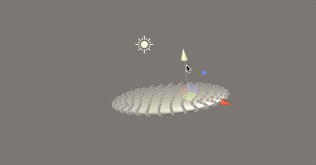
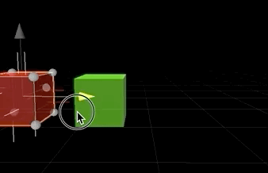
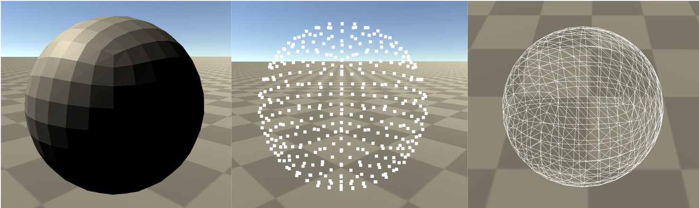
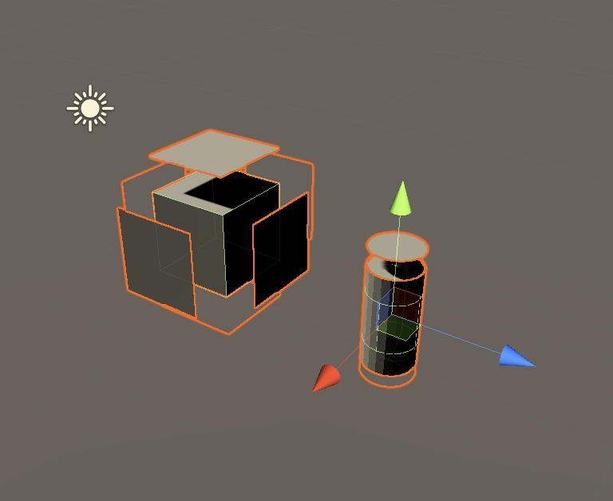

# Unity3D_3DModelProcessing

    <h1>Model Editor</h1>
    <h2>Intro</h2>
    
 a practice demo that show how to modify mesh data through Unity3D 

    <h2>How to use</h2>
    
 attach EditMesh Script to GameObject and remember to enable it

    <h2>If you don't want to use</h2>
    
 just Disable the script

    <h2>Preview</h2>
    
    <h1>Auto Snap</h1>
    <h2>Intro</h2>
    
 a practice demo that show how to auto snap your gameobject through each triangle of your mesh

    <h2>How to use</h2>
    
 attach SanpFace Script to GameObject and remember to enable it

    <h2>If you don't want to use</h2>
    
 just Disable the script

    <h2>Preview</h2>
    
    <h1>Mesh Topology</h1>
    <h2>Intro</h2>
    
 a practice demo that show how to change topology of mesh

    <h2>How to use</h2>
    
 attach SetRenderMode Script to GameObject and remember to enable it

    <h2>If you don't want to use</h2>
    
 just Remove the script

    <h2>Preview</h2>
    
    <h1>Split Mesh surface depend on normal</h1>
    <h2>Intro</h2>
    
 a practice demo that show how to slpit every surface from the mesh

    <h2>How to use</h2>
    
 attach SplitSurface Script to GameObject and remember to enable it

    <h2>If you don't want to use</h2>
    
 just Remove the script

    <h2>Preview</h2>
    

